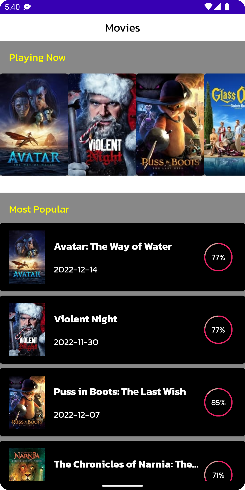
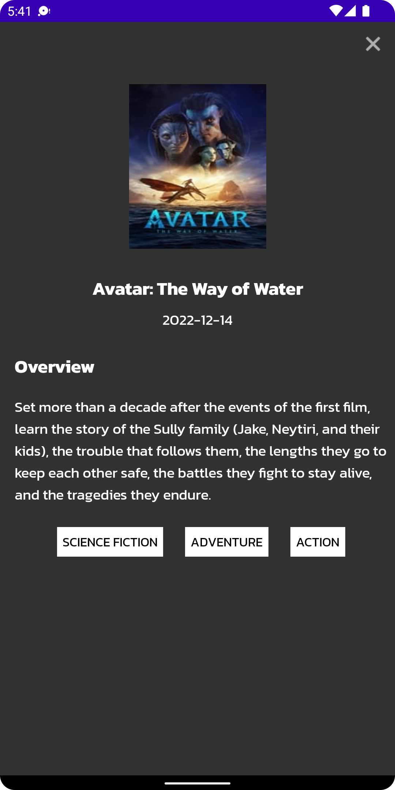
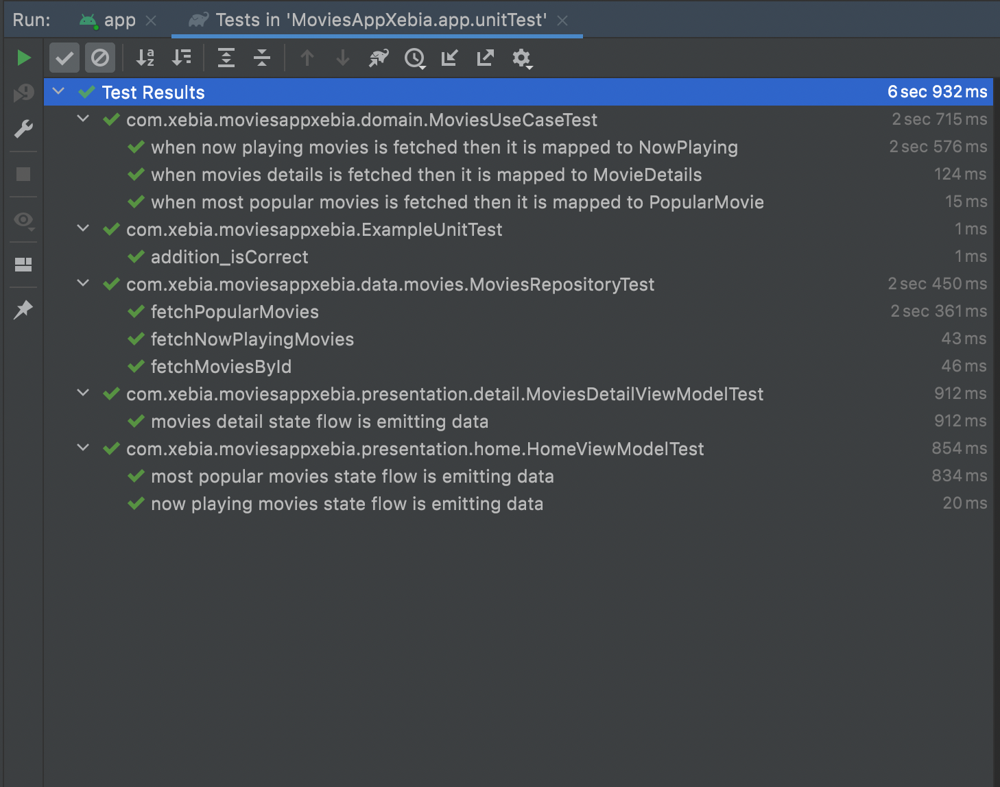

# MoviesAppXebia
# A demo android application which allow user to search and loads the movies from remote server. On click of movie list item user can navigate to detail screen. It demonstrates several aspect of Android application development. The code is fully written in Kotlin

## Application architecture

Google recommended app development architecture is followed. For this architecture ViewModel is at the core of an architecture. ViewModel is lifecycle aware and hence provides a great benefit when it comes to controlling view, data and asynchronous tasks. Check the following diagram which explains that each component in dependent on it's lower level component. e.g. Activity/Fragment is dependent on it's ViewModel. A ViewModel is connected to use case layer which is responsible for manipulating data coming from apis in bulk and this layer further connected with repository layer. Repository's sole responsibility it to provide data from remote server.

## Why architecture component?

ViewModel is lifecycle aware and when Activity/Fragment is destroyed recreating and achieving the old state comes very easy.
Repository separates the concern and provide clear way of handling data. With little refactoring A repository can support fetching data from both local and remote data source. So caching becomes easy.

| Movie list | Movie detail |
| ----------- | ----------- |
|  |  |

## Testing approach
It is very important how user is going to interact with your application. Writing test cases gives assurance that application is stable and safe for your user.
It allows you to refactor code easily.
It captures business requirements in form of test cases.

| Unit Test |
| ----------- |
|  |

- **Run unit test:** `./gradlew :app:test`

## Libraries used
| Library name | Purpose |
| ----------- | ----------- |
| [Compose](https://developer.android.com/jetpack/compose?gclid=Cj0KCQiAtvSdBhD0ARIsAPf8oNkDAMncWNBZYk-wQFw7LKWQKCmC6PLH64quv2kZuYcc8oONIZ54BS0aAvBmEALw_wcB&gclsrc=aw.ds) | It simplifies and accelerates UI development on Android.|
| [Retrofit](https://square.github.io/retrofit/) | A type-safe HTTP client for Android  |
| [JUnit](https://junit.org/junit4/) | Testing framework which runs test cases on JVM  |
| [Mockk](https://mockk.io/) | Mocking library for Kotlin  |
| [Mock Webserver](https://github.com/square/okhttp/tree/master/mockwebserver) | Mocking network calls while running UI tests |
| [Flow](https://kotlinlang.org/docs/flow.html) | Manage data stream asynchronously |
| [Picasso](https://square.github.io/picasso/) | A powerful image downloading and caching library for Android  |

